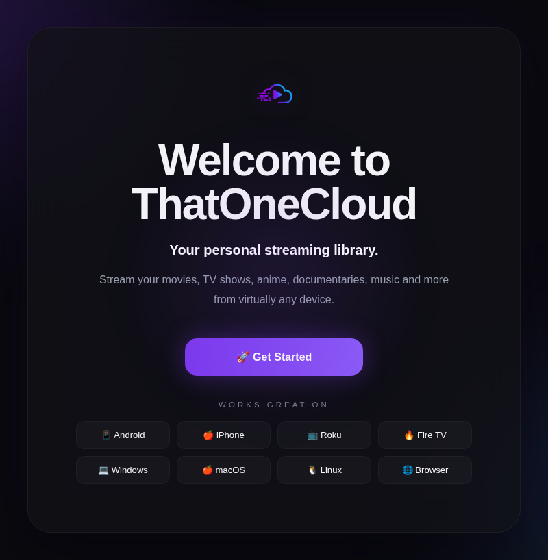
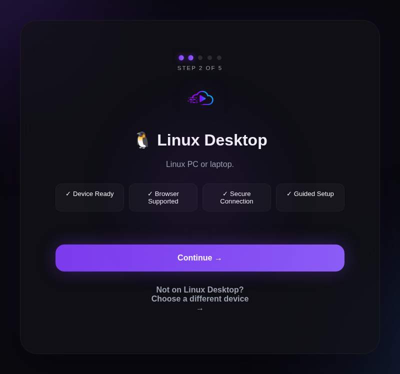
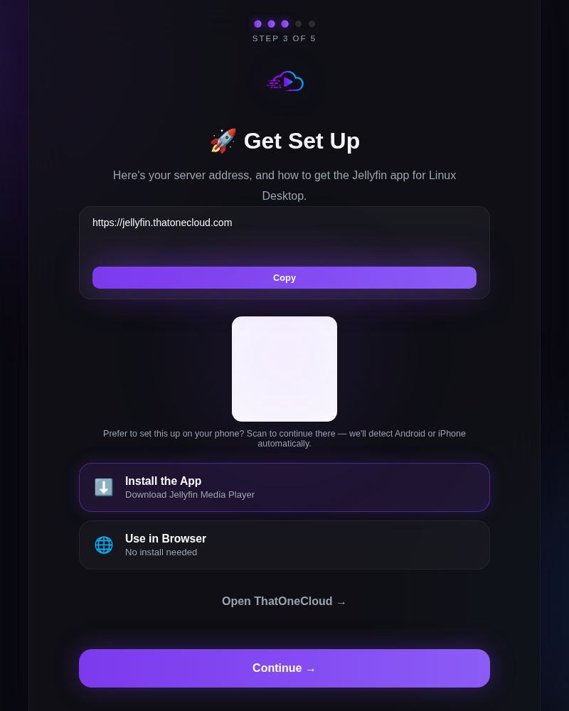
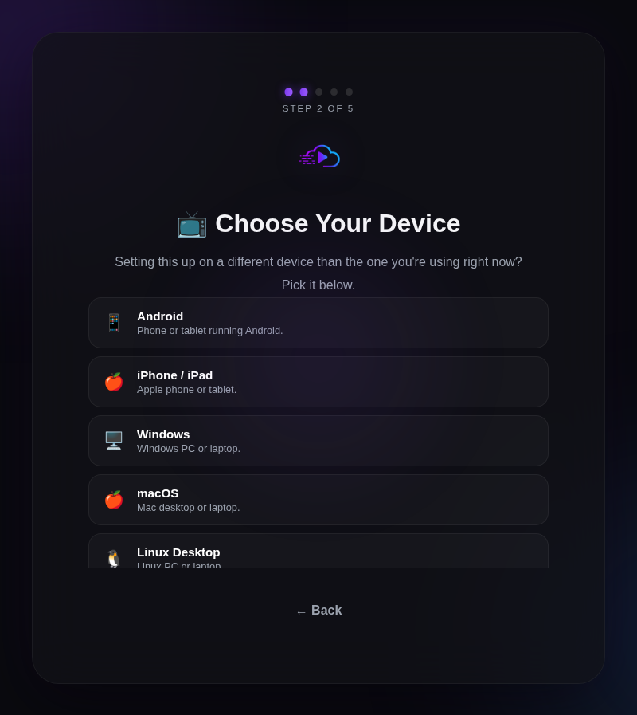
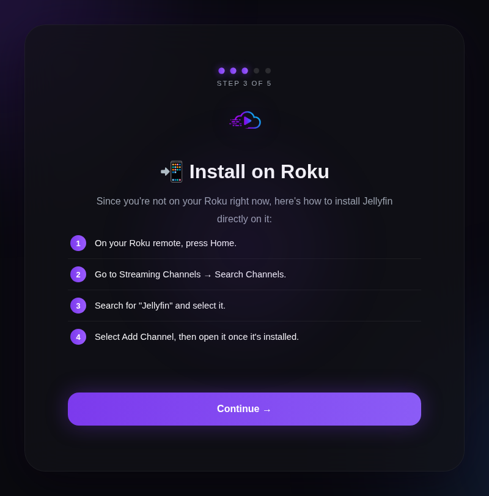
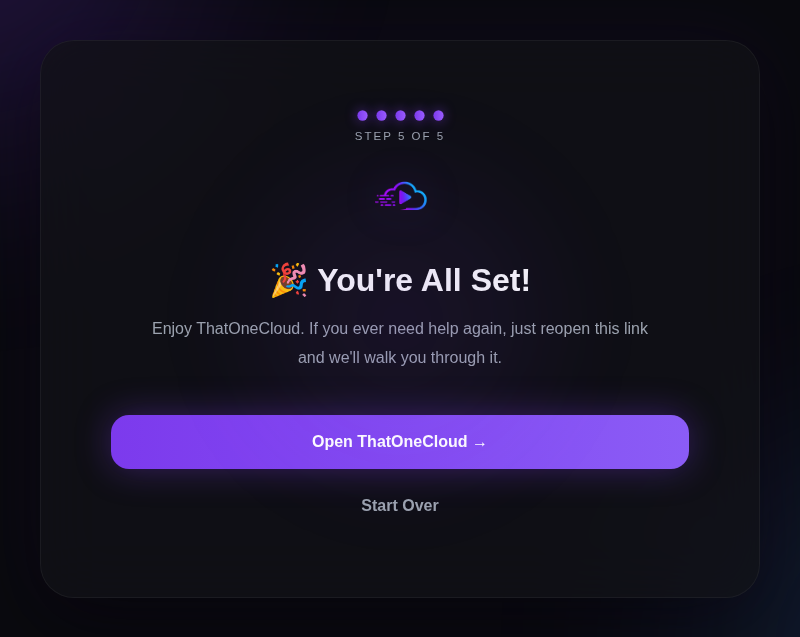

# Jellyfin Onboarding

A polished, self-detecting onboarding wizard for Jellyfin. Send someone
one link, and they land on a wizard that automatically figures out their
device, gets them the right app (or the right browser flow), and walks
them through connecting to your server — no technical knowledge required.

Built to sit alongside [Wizarr](https://wizarr.dev/) (which handles
account creation) and pick up exactly where Wizarr leaves off, but it
works standalone too if you just want a nicer "how do I connect"
landing page for your server.



## Built with Claude

This project was built through an extended, hands-on collaboration with
[Claude](https://claude.ai) (Anthropic's AI assistant) — nearly all of
the code was written by Claude, based on direction, design decisions,
real-device testing, and deployment work by
[DarkZennen](https://github.com/DarkZennen). Bugs were found through
actual usage (screenshots of real devices, real console errors) and
fixed iteratively the same way any project gets built, just with an AI
doing the implementation. Flagging this upfront for transparency, in
case it's relevant to how you evaluate or use this code.

## Why this exists

If you self-host Jellyfin for friends and family, you already know the
support requests: *"which app do I download?"*, *"what's the server
address again?"*, *"it's asking me for a password on my TV and I don't
want to type it with the remote."* Jellyfin Onboarding exists to answer
all of that automatically, before anyone has to ask.

## Features

- **Automatic device detection** — knows if you're on Android, iPhone,
  Windows, macOS, Linux, or a browser, and adjusts the flow accordingly
- **"Not this device?" picker** — if someone opens the invite on their
  phone but is actually setting up their Roku or Google TV, one tap
  switches the whole flow to the right device
- **TV-aware flow** — Roku, Fire TV, Android TV/Google TV, and Apple TV
  get plain-language install steps instead of a download link that
  wouldn't help (you can't install an app on your TV from your phone's
  browser), plus a callout about Jellyfin's **Quick Connect** feature so
  nobody has to type a password with a remote
- **QR codes that do something useful** — on desktop, the QR doesn't
  just open the server URL, it reopens this wizard itself on whatever
  device scans it, which then runs its own device detection fresh
- **Clipboard auto-copy** — tapping "Install the App" copies your
  server address to the clipboard right away, so it's already there to
  paste the moment the app opens, even if someone doesn't think to
  switch back to the browser
- **Wizarr integration, both directions** — works whether someone
  reaches Wizarr first (and gets handed off to this wizard after
  account creation) or reaches this wizard first via a `?invite=CODE`
  or `/j/CODE` link (and gets handed off to Wizarr to create their
  account)
- **No backend, no database** — pure static HTML/CSS/JS. Runs anywhere
  that can serve static files

## Screenshots

| Device step | Install + connect | "Not this device?" picker |
|---|---|---|
|  |  |  |

| TV install instructions | Finished |
|---|---|
|  |  |

## Prerequisites

- A running [Jellyfin](https://jellyfin.org/) server
- Docker (or any static file host — see [Deploying without Docker](#deploying-without-docker))
- Optional: [Wizarr](https://wizarr.dev/) if you want invite-link
  account creation. This works fine without it — it just becomes a
  "how to connect" page instead of a full invite flow.
- Optional: a reverse proxy (Traefik, nginx, Caddy, Cloudflare Tunnel,
  etc.) if you want a real domain and HTTPS

## Quick start

1. **Clone the repo:**

   ```bash
   git clone https://github.com/DarkZennen/jellyfin-onboarding.git
   cd jellyfin-onboarding
   ```

2. **Configure it for your server** — edit `www/js/config.js`. At
   minimum, set:

   ```js
   serverUrl:  "https://jellyfin.yourdomain.com",
   wizarrUrl:  "https://invites.yourdomain.com",   // only if you use Wizarr
   ```

   See the comments at the top of that file for the full list of what's
   required vs. optional to change.

3. **Build and run:**

   ```bash
   docker build -t jellyfin-onboarding .
   docker run -d -p 8080:80 --name jellyfin-onboarding jellyfin-onboarding
   ```

   Visit `http://localhost:8080` — you should see the welcome screen.

4. **Put it behind your reverse proxy / domain** so people can actually
   reach it. The included `docker-compose.yml` has Traefik labels as a
   *worked example* from the reference deployment — you'll need to
   adjust the network name, `Host()` rule, and cert resolver to match
   your own setup, or replace the labels with whatever your reverse
   proxy needs, or just expose the port directly if you don't use one.

### Deploying without Docker

`www/` is a plain static site with no build step. Any static file host
works — nginx, Apache, Caddy, GitHub Pages, Cloudflare Pages, a plain
`python3 -m http.server`, whatever you've already got. The only two
things to get right:

- **Serve `www/` as the site root** (not a subdirectory) — some
  internal links assume root-relative paths
- **Fetch the QR code library once**, since it's deliberately not
  committed to the repo:

  ```bash
  curl -o www/js/vendor/qrcode.min.js \
    https://cdnjs.cloudflare.com/ajax/libs/qrcode-generator/1.0.3/qrcode.min.js
  ```

  (If you use the provided `Dockerfile`, this happens automatically
  during the build — nothing to do.)

## Connecting Wizarr

If you use Wizarr for invite links, there are two ways someone can
reach the combined flow:

- **This wizard first:** send people `https://your-onboarding-domain/?invite=CODE`
  (or `/j/CODE`) instead of the raw Wizarr link. They land on your
  branded wizard immediately; tapping "Accept Invite" opens the real
  Wizarr signup in a new tab while device detection continues here.
- **Wizarr first:** if someone gets a raw Wizarr link instead, you can
  add a button to Wizarr's post-invite custom HTML pointing back at
  your onboarding wizard's URL, so they land here right after creating
  their account. See Wizarr's own invite-step customization settings
  for where to add this.

## Releasing (CI/CD)

This repo ships with GitHub Actions already wired up:

- **`.github/workflows/ci.yml`** — runs on every push/PR: syntax-checks
  all JS files and verifies the Docker image builds
- **`.github/workflows/release.yml`** — runs when you push a version
  tag (`v*`): builds and publishes the image to GitHub Container
  Registry as both `:latest` and `:X.Y.Z`, with the version stamped
  onto every asset URL (`pages.js?v=X.Y.Z`) so CDN/browser caches never
  serve stale JS/CSS after a release

To cut a release:

```bash
git tag vX.Y.Z
git push origin vX.Y.Z
```

First release only: go to your GitHub profile → **Packages** → the
published package → settings → set visibility to **Public**, so
anyone (including your own server) can pull it without authentication.

Then on your server:

```bash
docker compose pull
docker compose up -d
```

## Project layout

```
www/                     static site (served by nginx in the container)
  index.html
  css/
  js/
    config.js            <- the file you edit to customize this
  assets/
docs/screenshots/         README images
Dockerfile                 nginx:alpine, serves www/, stamps version on assets
nginx.conf                 static-site nginx config (gzip, caching, security headers)
docker-compose.yml         example service definition with Traefik labels
.github/workflows/         CI (build check) + Release (build & publish) automation
```

## Architecture notes

- **No framework, no build step.** Plain HTML/CSS/JS, loaded directly by
  the browser via `<script>` tags. See `CONTRIBUTING.md` if you want to
  understand the reasoning and the code style.
- **Device detection** (`www/js/detect.js`) runs entirely client-side
  based on `navigator.userAgent`.
- **`www/js/config.js`** is the single source of truth for anything
  deployment-specific: your server URL, your Wizarr URL, the device
  catalog, and per-platform install instructions.

## Contributing

Contributions are welcome — see [`CONTRIBUTING.md`](CONTRIBUTING.md) for
project philosophy, local dev setup, and code style.

## Credits

- [Jellyfin](https://jellyfin.org/) — the media server this all exists
  to onboard people onto
- [Wizarr](https://wizarr.dev/) — invite/account-creation system this
  integrates with
- [qrcode-generator](https://github.com/kazuhikoarase/qrcode-generator)
  by Kazuhiko Arase (MIT licensed) — QR code generation
- [Claude](https://claude.ai) — wrote nearly all of the code in this
  repository (see [Built with Claude](#built-with-claude) above)

## License

MIT — see [`LICENSE`](LICENSE).
